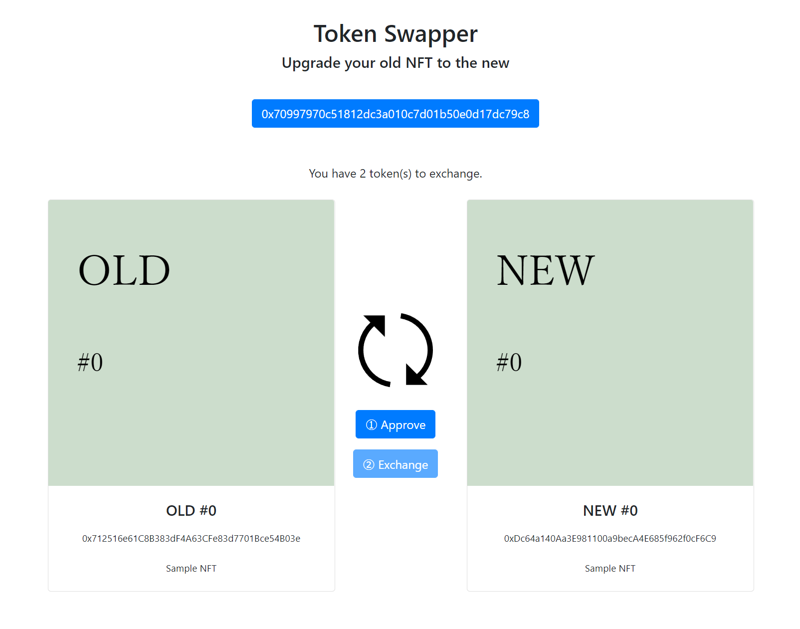

# TokenSwapper

同じ tokenId の ERC721 トークンを交換します（新旧の NFT の交換等）



video↓
https://youtu.be/pRtZOoqN4Cc

- TokenSwapper.sol スワップ用コントラクト
- ERC721BE.sol テスト用コントラクト

## 使い方

① TokenSwapper のコントラクトデプロイ時に旧 NFT アドレス、新 NFT アドレス、旧 NFT の burn の有無を設定します。

```javascript
const TS = await ethers.getContractFactory("TokenSwapper");
const ts = await TS.deploy(nftOld.address, nftNew.address, true);
await ts.deployed();
```

②TokenSwapper に交換用の NFT を mint するか送付しておいてください

```javascript
await nftNew.mint(ts.address);
```

詳細はソースコードを読んでください。

## ローカル環境でのテスト

```shell
$ npx hardhat node
$ npx hardhat run .\scripts\deploy-tokenswapper.js --network localhost
```

localhost でのテスト用 webinterface/tokenswapper.html

ローカルでのテスト時は、hardhat のアカウント 1 （0x70997970C51812dc3A010C7d01b50e0d17dc79C8）に NFT を発行していますので Metamask では個のウォレットを設定してください。。

```javascript
// script/test-tokenswapper.js
await nftOld.connect(accounts[1]).mint(accounts[1].address);
await nftOld.connect(accounts[1]).mint(accounts[1].address);
```
